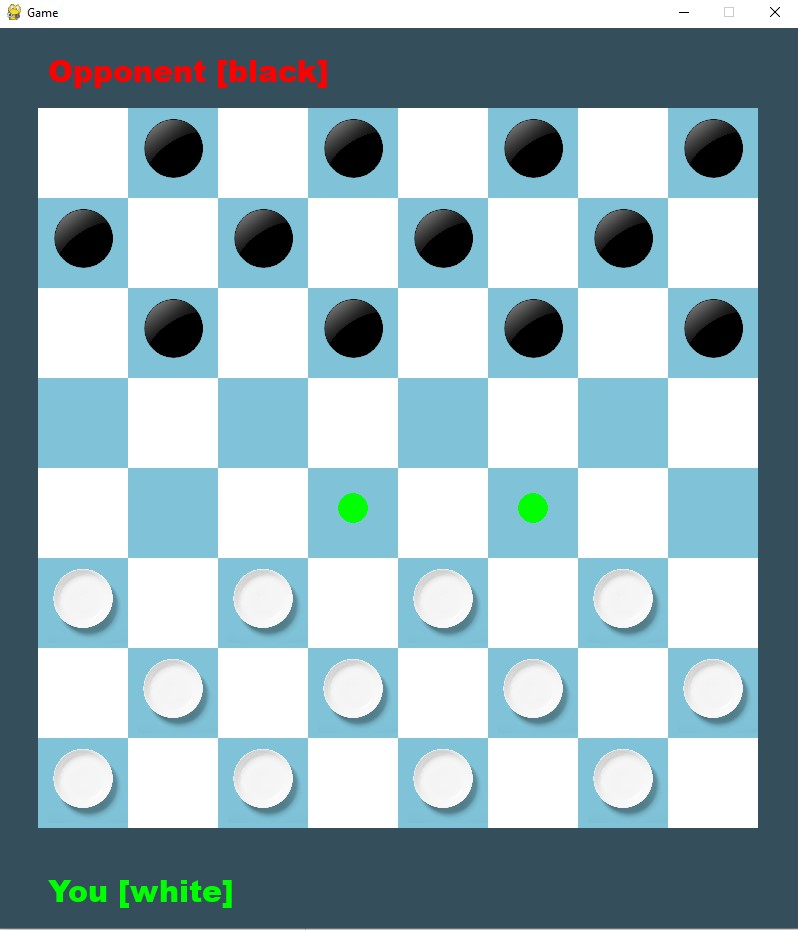
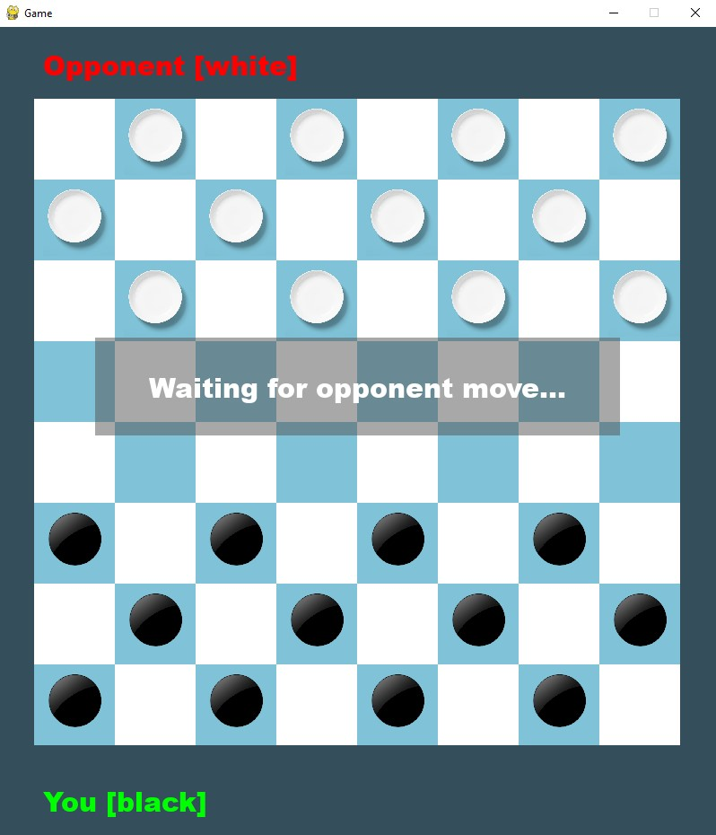

# PUT_SK2-Checkers
client-server checkers game for Computer Networks class
Server - Linux
Client - Windows/Linux

## Installation

Requirements:
Python, PyGame, C++ compiler

PyGame installation:
> pip install pygame

1. Compile server file
> g++ -pthread -Wall server.cpp -o server

2. Run server
> ./server

3. Run client
> python client.py <ip_address>

## Screenshots

### Lobby Screen

  

### Game Screen

  
  

